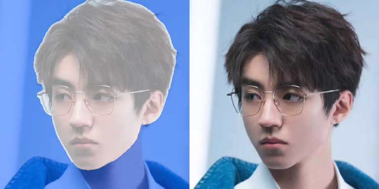
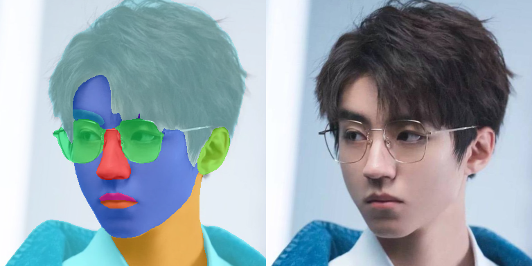
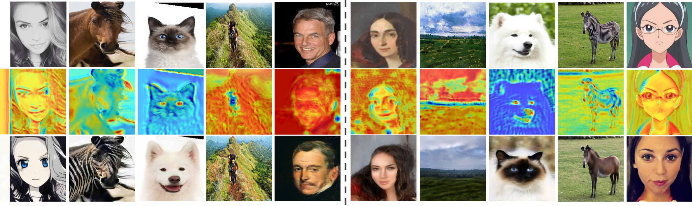
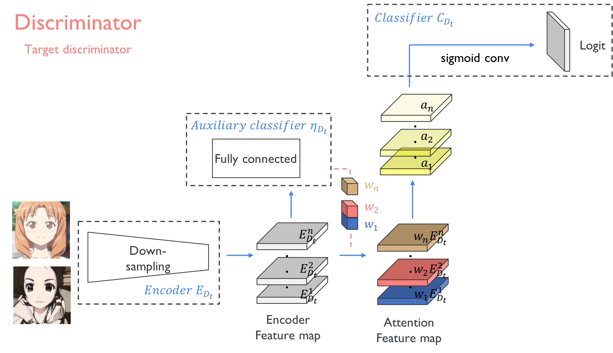
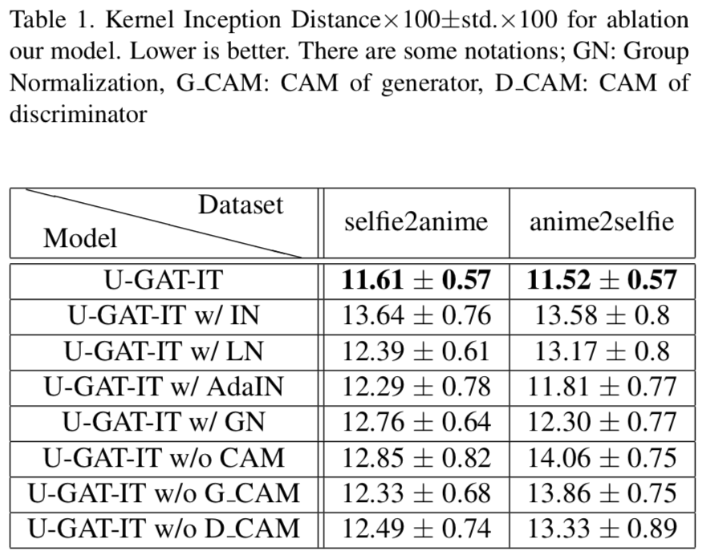
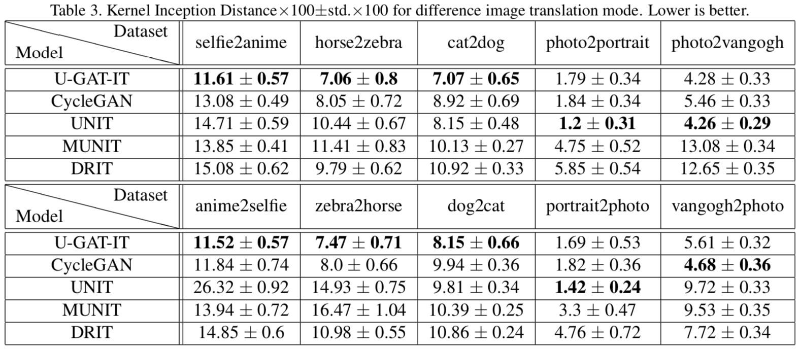

# enhanced-U-GAT-IT

知乎上关于论文的解读blog：
- [论文阅读 | 图像转换(五) AttentionGAN](https://zhuanlan.zhihu.com/p/168382844)
- [论文阅读 | 图像转换(六) U-GAT-IT](https://zhuanlan.zhihu.com/p/270958248)

专栏内及其他专栏有更多内容，欢迎进行技术讨论~

## Usage

```shell
CUDA_VISIBLE_DEVICES=2 python main.py --dataset YOUR_DATASET_NAME --result_dir YOUR_RESULT_DIR \
# 适当减小light可降低显存的使用
 --light 32 \
--img_size 384 --aug_prob 0.2 --device cuda:0 --num_worker 1 --print_freq 1000 --calc_fid_freq 10000 --save_freq 100000 \
# 适当提高forward_adv_weight系数可适当增强 A2B的风格化程度
--adv_weight 1.0 --forward_adv_weight 1 --cycle_weight 10 --identity_weight 10 \
# ema大幅提高模型稳定性和fid
--ema_start 0.5 --ema_beta 0.9999 \
# 固定背景参数
# 去除判别器中的CAM和logit loss
--cam_D_weight -1 --cam_D_attention \
# 使用faceseg分割出背景做L1损失
--seg_fix_weight 100 \
# 背景的判别器损失丢弃mask区域的损失
--seg_D_mask \
# 背景detach
--seg_G_detach \
# D判别器可以设置较为local
--n_global_dis 7 --n_local_dis 5
--has_blur --use_se
# 如果attention_input想配合背景固定一起用的话，建议加大对抗loss的权重 adv_weight -> 10 甚至更大
--attention_gan 2 --attention_input
```

本地调试的话：`--device cuda:0` -> `--device cpu`，

## 基于官方U-GAT-IT[1]做改进：

- 代码结构优化：
  - 将`UGATIT.py`中的`train`函数的部分代码模块化为函数(`get_batch, forward, backward_G, backward_D`);
  - 增加训练时损失函数的打印，tensorboard记录；
  - 优化了官方代码中一次多余的前向推理，约节省20%的训练时间。
  
- 功能增强（可选是否开启）：
  - `--ema_start`: 开始做模型ema的迭代次数的比例数，也就是`--iteration 100 --ema_start 0.7`表示 `100 * 0.7 = 70` 个迭代后开始做模型ema；
  - `--ema_beta`: 模型ema的滑动平均系数；
  - `--calc_fid_freq`: 计算fid score的频率，应该设置为`--print_freq`的整数倍；
  - `--fid_batch`: 每次计算fid score时，推理时使用的`batch size`；
  - `--adv_weight, forward_adv_weight, backward_adv_weight`: 将对抗损失项权重分成3个（原始的对抗损失项权重，A2B对抗损失项的权重，B2A的对抗损失项权重）；
  - `--aug_prob`: 数据增强`RandomResizedCrop`的概率；
  - `--match_histograms`：是否将两个域进行直方图匹配，使两个域的分布一致；[2]
  - `--match_mode`：直方图匹配时的匹配模式，(hsv, hsl, rgb)中的一个；
  - `--match_prob`：将域B的图像往域A进行直方图匹配的概率，否则将域A的图像往域B直方图匹配；
  - `--match_ratio`：直方图匹配的比例，匹配图 * ratio + 原图 * （1 - ratio）；
  - `--sn`: 判别器中，卷积操作后是否进行谱归一化，默认使用，tf官方代码有，pt官方代码没有；
  - `--has_blur`: 判别网络训练/模型更新时，损失项中增加模糊对抗损失项，增强D对模糊图片的判别；[3]
  - `--use_se`: 在生成网络中，是否给每个`ResnetBlock, ResnetAdaILNBlock`增加`scse block`；[4]
  - `--attention_gan`: 生成网络中，是否使用`attention mask`机制（在上采样前多一个分支，用于生成mask）；[5]
  - `--use_deconv`: 生成网络中，上采样是否使用反卷积`nn.ConvTranspose2d`，默认使用插值+卷积方式；
  - `--seg_fix_weight`: 人脸分割[6]损失权重（本库代码默认的分割区域为下图的二分类图，借鉴的库可实现多个类别的解析），将原图与生成图在背景区域上做L1损失；
  - `--seg_D_mask`: 背景区域的对抗损失置0、背景区域的判别损失置0；
  - `--seg_G_detach`: 生成图的背景区域detach掉再放入D网络做对抗；
  - `--seg_D_cam_inp_mask`: 训练D网络时，整个背景替换为0作为CAM分支的输入；
  - `--seg_D_cam_fea_mask`: 训练D网络时，将CAM分支的feature map的背景区域替换为0；
  - `--cam_D_weight -1 --cam_D_attention`: 将CAM的attention和logit loss砍掉。

 

- 其他功能：
  - `--phase`: 模型的训练/验证/测试/视频/视频文件夹/摄像头/图像文件夹/以对齐的人脸图像文件夹 模式（`'train', 'val', 'test', 'video', 'video_dir', 'camera', 'img_dir', 'generate'`）；

## 文件目录说明

- `assets`： `README.md`中的图像；
- `dataset`: 图像数据
- `faceseg`: 人脸分割部分代码与明星权重文件夹；
- `metrics`: FID score 计算脚本；
- `scripts`: 运行命令shell脚本文件夹；训练、测试的运行指令可以参考这里~
- `videos`: 视频测试脚本；
- `dataset.py`: 数据集；
- `histogram.py`: 直方图匹配；
- `main.py`: 程序主入口，配置信息；
- `networks.py`: 生成器、判别器网络结构
- `UGATIT.py`: 整个训练、测试过程的执行脚本；
- `utils.py`: 工具脚本；

## 补充实验说明

- 部分代码修改：官方其实主库是tensorflow的库，pytorch是根据tensorflow写的，其中有比较多的差异，本库修正了部分差异；
- 损失项权重：在`CycleGAN`实验中发现，适当增加A2B阶段的损失项权重，有利于提升A2B阶段的图像生成质量；
- 反卷积和谱归一化：在`CycleGAN`实验中发现，使用反卷积和去除谱归一化有利于生成网络对原图做更强的变化；
- 模糊对抗对纹理区分度略有提升；
- attention mask fusion：在本库中实验，发现提升不大，不同任务需进一步实验；同时提供了一个把输入图与生成图一起做区域融合的选项；
- scse模块：在本库中实验，发现提升不大，不同任务需进一步实验；
- 在控制人脸除外的背景不变时，使用`faceseg`具有一定效果，可配合背景随机换色一起使用；
- 直方图匹配在两个域比较接近，但是分布存在差异的时候有效，例如 大人 -> 小孩，其他情况可能只对某个通道进行直方图匹配就可，例如在value上使得光照一致；
- 在两个域的色调等存在分布差异时，还可考虑将输入D的图像先转为灰度图，再进行判别；类似AnimeGAN的做法。

## reference

[1] UGATIT官方pytorch实现，也是本库baseline：https://github.com/znxlwm/UGATIT-pytorch;  
[2] 直方图匹配参考 [Bringing-Old-Photos-Back-to-Life](https://github.com/microsoft/Bringing-Old-Photos-Back-to-Life) ； 
[3] CartoonGAN: Generative Adversarial Networks for Photo Cartoonization;  
[4] Concurrent Spatial and Channel ‘Squeeze & Excitation’ in Fully Convolutional Networks;  
[5] AttentionGAN: Unpaired Image-to-Image Translation using Attention-Guided Generative Adversarial Networks;   
[6] 人脸分割模型库：[zllrunning/face-parsing.PyTorch](https://github.com/zllrunning/face-parsing.PyTorch) ；


------
（以下为官方原始 readme 部分）

## U-GAT-IT &mdash; Official PyTorch Implementation
### : Unsupervised Generative Attentional Networks with Adaptive Layer-Instance Normalization for Image-to-Image Translation

<div align="center">
  
</div>

### [Paper](https://arxiv.org/abs/1907.10830) | [Official Tensorflow code](https://github.com/taki0112/UGATIT)
The results of the paper came from the **Tensorflow code**


> **U-GAT-IT: Unsupervised Generative Attentional Networks with Adaptive Layer-Instance Normalization for Image-to-Image Translation**<br>
>
> **Abstract** *We propose a novel method for unsupervised image-to-image translation, which incorporates a new attention module and a new learnable normalization function in an end-to-end manner. The attention module guides our model to focus on more important regions distinguishing between source and target domains based on the attention map obtained by the auxiliary classifier. Unlike previous attention-based methods which cannot handle the geometric changes between domains, our model can translate both images requiring holistic changes and images requiring large shape changes. Moreover, our new AdaLIN (Adaptive Layer-Instance Normalization) function helps our attention-guided model to flexibly control the amount of change in shape and texture by learned parameters depending on datasets. Experimental results show the superiority of the proposed method compared to the existing state-of-the-art models with a fixed network architecture and hyper-parameters.*

## Usage
```
├── dataset
   └── YOUR_DATASET_NAME
       ├── trainA
           ├── xxx.jpg (name, format doesn't matter)
           ├── yyy.png
           └── ...
       ├── trainB
           ├── zzz.jpg
           ├── www.png
           └── ...
       ├── testA
           ├── aaa.jpg 
           ├── bbb.png
           └── ...
       └── testB
           ├── ccc.jpg 
           ├── ddd.png
           └── ...
```

### Train
```
> python main.py --dataset selfie2anime
```
* If the memory of gpu is **not sufficient**, set `--light` to True

### Test
```
> python main.py --dataset selfie2anime --phase test
```

## Architecture


---



## Results
### Ablation study


### User study


### Comparison

